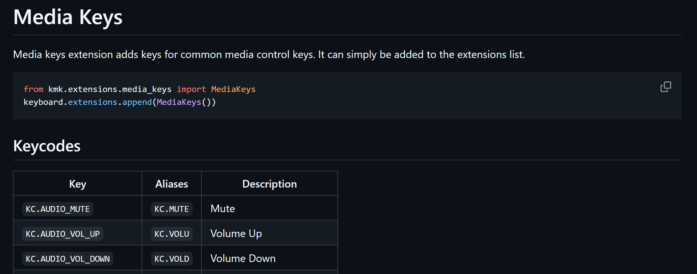

Total time - ~9 hrs

July 6th - day 1 (~3 hrs)

Started building a hackpad. Decided to create a 4 key macropad for volume controls as I use a 65% keyboard at home and often find it hard to switch songs or change volume during a game or other fullscreen applications.

no idea why this was so hard for me to figure out lol

Followed the hackpad guide, creating the basic schematic and PCB with relative ease. Upon finishing the PCB, I spent 20 minutes trying to fix the silkscreen errors on the DRC until I went back to the guide and saw that you don't need to worry about that lol

July 9th - day 2 (~5 hrs)

Built the case by following the guide again. Fusion 360 was definitely a pain as I'd never used it before and a lot of the tools felt very finicky. Constraints and sketch dimensions were very confusing to me at first as it felt like it would be completely random if the sketch dimension would be editable or not.

Firmware was simple enough, as I could use the starter code and a quick look through the documentation helped me find out how to import and use media keys.

Assembling was just a matter of grabbing assets from various places and throwing them all together. Once that was done, I was ready to submit! I generated a BOM from KiCad, which was surprisingly easy and complete. With everything else done, I threw together a README including a few photos from various points in my project and submitted the project for review.

July 10th - day 3 (~1 hr)
Got feedback on this day that I needed to add an extra component. Because this was intended for media control, it was a no brainer to add a rotary encoder for volume control, freeing up a few keys for macros or other uses later on. 

The rotary encoder was as simple as adding it in the schematic, then updating the pcb and dragging it into place there, and then finally grabbing the asset from KiCad so I could put it into the final design on Fusion360.
