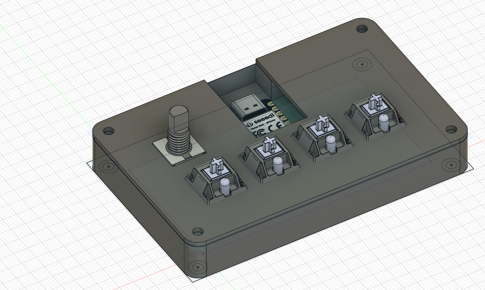
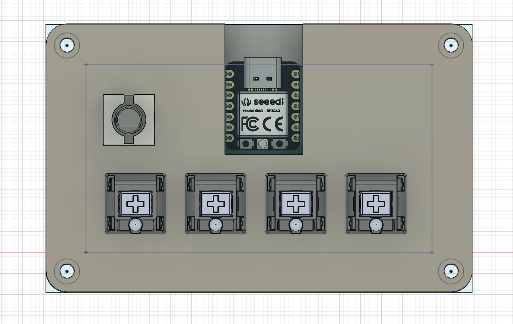
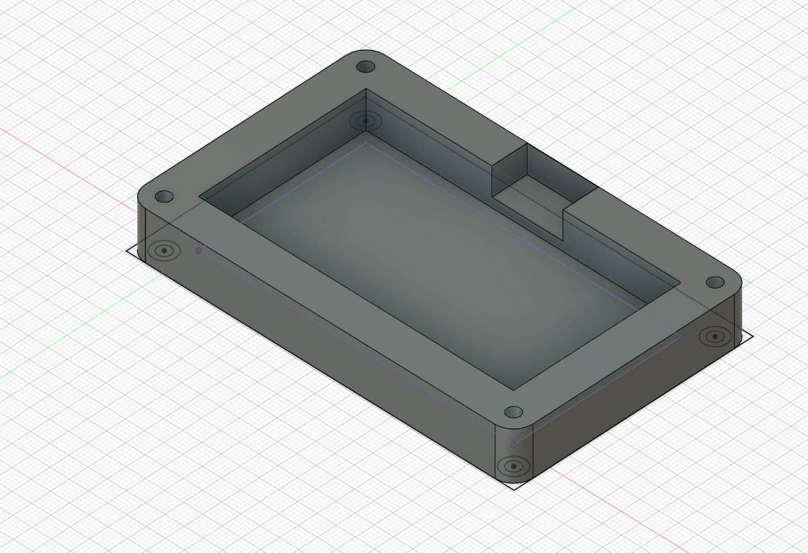
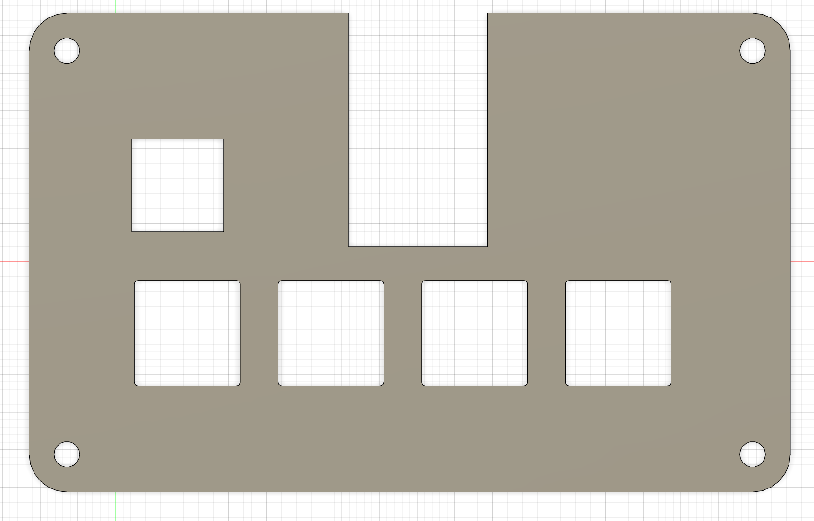
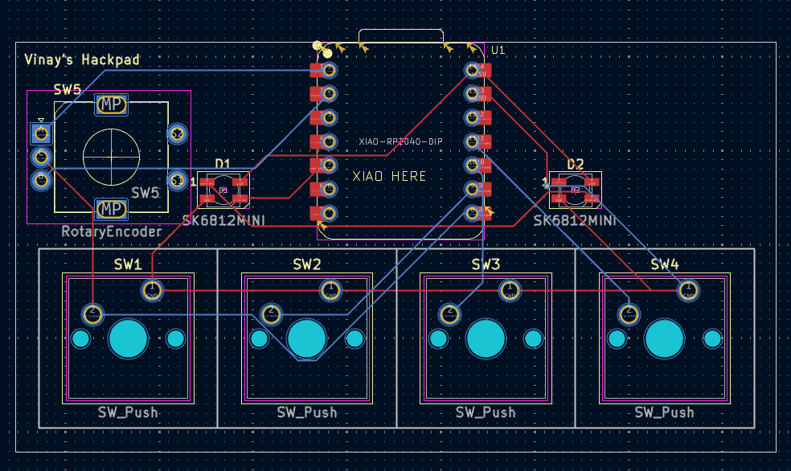
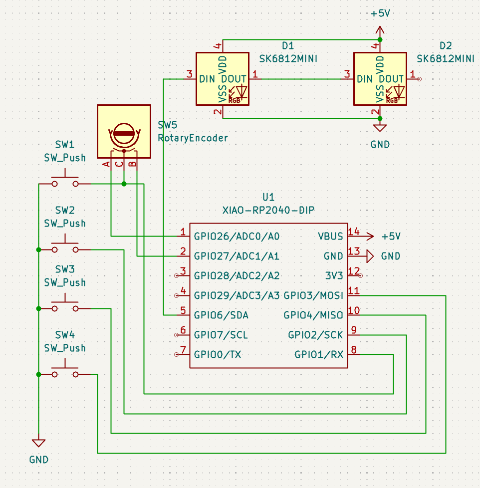

Vinay's Hackpad

4-key macropad for highway. Made it to use for media controls as I use a 65% keyboard and don't have easily accessible media buttons. Might be used to play osu or other rhythm games.

**BOM**
- [2x SK6812MINI LED](https://www.aliexpress.us/item/3256807677321116.html?spm=a2g0n.productlist.0.0.32c26adfQjNnAs&browser_id=86e21a8f90774a0fbfb6b771741b58e7&aff_platform=msite&m_page_id=eafafbfbbbe197fc260a3a583ec9b0c76d2ac91438&pdp_ext_f=%7B%22order%22%3A%2264%22%2C%22eval%22%3A%221%22%7D&pdp_npi=4%40dis%21USD%213.24%210.99%21%21%213.24%210.99%21%402101c5ac17522820408753591e6d6c%2112000042594617264%21sea%21US%210%21ABX&algo_pvid=5ed95bd4-e2c2-4022-ac43-13801af5ac11)
- [4x Cherry MX Switches](https://milktooth.com/products/mx-brown?gQT=2)
- [1x Rotary Encoder](https://www.digikey.ca/en/products/detail/alps-alpine/EC11E15244G2/1802623)
- [1x XIAO RP2040 DIP](https://www.seeedstudio.com/XIAO-RP2040-v1.0-p-5026.html)
- [4x M3x16bolt](https://www.amazon.com/uxcell-M3x16mm-Socket-Button-Screws/dp/B09Q5X8321?dib=eyJ2IjoiMSJ9.Rv1zcXROlM4cQj5SvnfqjflwtMnN7J6dZMX5HI0awOO-Qpq2d40BL-NrLKIhb9kPBDHhrgI1vDcZYYR33jGSi7wpB3qrx4Xi4rrdACma4B9xcAtDAflvdahEyLfoDsquz_J0xFqW4aExrcNPcIZ48yDyUSazTS2zf-w7cndpvw9ol1_xTkk6eHdOfWmaXafuvpvZiXMVz0ZGxFFCKJAVnMr5pSHKnHYuq0FwxfLBFiA.6_GJ67kktLlxNetJkFre4DbrVxGCHszF3StHNu8pksQ&dib_tag=se&keywords=M3x16mm&qid=1752284721&sr=8-4&th=1)
- [4x M3 heatset](https://www.aliexpress.us/item/2255800046543591.html)

## Pictures

